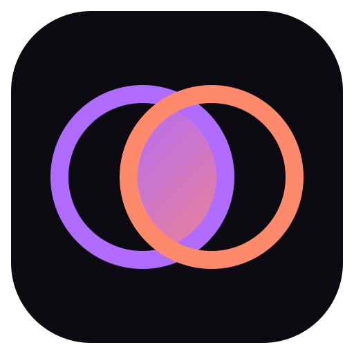

<div align="center">



# Iris

**A minimalist, Windows-first Chromium browser your AI agent drives, and you drive too.**

Built for the logged-in web that no public API exposes. Agent-agnostic over MCP, everything local.

</div>

## Overview

Iris is a real Chromium browser (Electron) on your machine. Your coding agent (Claude Code,
Cursor, Codex, any MCP client) operates it through your real, logged-in sessions, while you watch
live and take over anytime. It's the browser built for the human-and-agent workflow: the agent runs
its task in its own Space, you keep browsing in yours.

## Highlights

- **Spaces**: isolated, persistent sessions (own cookies and login), human and agent, in parallel.
- **Agent-agnostic (MCP)**: one server, plug into any MCP client. Ships an Iris skill.
- **Semantic snapshot**: a compact accessibility tree with refs, not screenshots or raw DOM.
- **You always know what it's doing**: a live activity trail and a nebula halo while it works.
- **Handoff**: captcha, OTP, and login are detected; it pauses and hands you the tab.
- **Approval gates and Autonomy toggle**: nothing irreversible without your OK, unless you allow it.
- **Reveal**: it brings what it references into your view and highlights it.
- **Export**: save pages and write reports or CSVs to disk.
- **Local and private**: your browser, your machine, no cloud, no telemetry.

## Install (users and testers)

1. Download the installer from [Releases](https://github.com/marvitphy/iris/releases/latest) and run it.
   On first launch Iris installs the MCP server and the Iris skill for your agent automatically.
2. Launch Iris and keep it open. Sign into the sites you want it to use.
3. Add the MCP server to Claude Code:
   ```bash
   claude mcp add iris -- node %LOCALAPPDATA%\Iris\iris-mcp.mjs
   ```
4. Restart Claude Code (loads the skill and tools).
5. Tell your agent what to do.

## Develop

```bash
npm install
npm run dev            # run the app (electron-vite)
npm run build:mcp      # build the MCP server bundle (dist-mcp/iris-mcp.mjs)
npm run build:icons    # regenerate build/icon.ico and PNGs from assets/
npm run typecheck
```

### Package a Windows installer

```bash
npm run dist:win       # produces release/Iris-Setup-<version>.exe
```

Or push a tag (`git tag v0.1.0 && git push --tags`) and GitHub Actions builds the installer and
attaches it to a release automatically.

## Architecture (short)

- **Electron shell**: acrylic UI, Spaces (persistent session partitions), tabs, the activity glow.
- **Engine**: `playwright-core` connected to Iris's own Chromium over CDP, `ariaSnapshot({mode:'ai'})`
  refs, click/type/scroll/evaluate/screenshot/reveal.
- **Control server**: local HTTP the MCP server talks to, publishes a handshake in `%LOCALAPPDATA%\Iris`.
- **MCP server**: stdio, around 26 tools, agent-agnostic. Source in `src/mcp`, bundled to `dist-mcp`.

## License

MIT. Uses [ai-motion](https://github.com/gaomeng1900/ai-motion) (MIT) for the activity halo.
