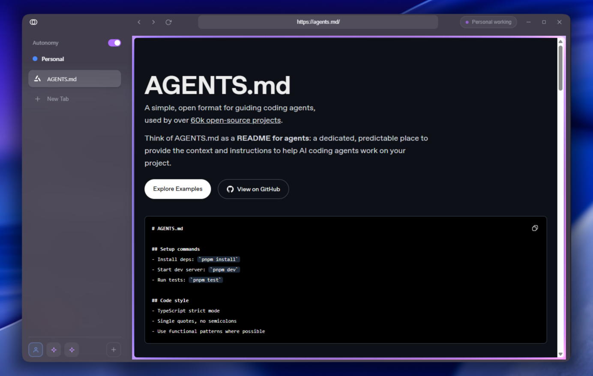

<div align="center">


# Iris

**A minimalist Chromium browser your AI agent drives, and you drive too.**

[](https://github.com/marvitphy/iris/releases/latest)
[](https://github.com/marvitphy/iris/actions/workflows/release.yml)
[](LICENSE)
[](tsconfig.json)
[](package.json)
[](src/mcp/server.ts)

[Download for Windows](https://github.com/marvitphy/iris/releases/latest) · [Architecture](ARCHITECTURE.md) · [Contributing](CONTRIBUTING.md)

</div>

<p align="center">
  
</p>

## What this is

Iris is a real browser (Electron and Chromium) running on your machine. Your coding agent operates it
through an MCP server, using **your real logged-in sessions**, for the web that no public API exposes:
social accounts, SaaS dashboards, admin panels, ticketing systems, anything behind a login.

It is not headless automation you cannot see, and it is not a browser that hijacks your tabs. The agent
works in its own **Space** while you keep browsing in yours, and you watch it happen: a halo wraps the
site while it acts, and it hands the wheel back when it hits a captcha, a one-time code, or anything
irreversible.

Everything runs locally. No cloud, no telemetry, no credentials leaving the machine.

## Quick start

1. **Install.** Download the installer from [Releases](https://github.com/marvitphy/iris/releases/latest)
   and run it. On first launch Iris installs its MCP server and agent skill for you.
2. **Open Iris and sign in** to the sites you want the agent to use. Sessions persist per Space.
3. **Connect your agent.** Open Settings (the Iris mark, top left) and press **Register with Claude
   Code**, or run it yourself:
   ```bash
   claude mcp add --scope user iris -- node %LOCALAPPDATA%\Iris\iris-mcp.mjs
   ```
4. **Restart your agent** so it loads the skill and tools.
5. **Tell it what to do.**
   ```
   Research the top ticketing platforms, compare their fees, and save me a CSV.
   ```

Settings shows, at a glance, whether the MCP server, the skill, the registration and a live agent are
all in place, with a one-click repair when they are not.

## What it does

|  |  |
|---|---|
| **Spaces** | Isolated, persistent sessions with their own cookies, tabs and login. Human and agent Spaces run side by side. |
| **Agent-agnostic** | One MCP server, 38 tools. Claude Code, Cursor, Codex, anything that speaks MCP. |
| **Sees pages semantically** | A compact accessibility tree with stable refs, not screenshots and not raw DOM. Cheap in tokens, precise to act on. |
| **You see it working** | A halo wraps the site while the agent acts, its Space pulses in the rail, and it narrates what it is doing. |
| **Handoff** | Captcha, OTP and login walls are detected: Iris pauses, notifies you, and gives you the real tab. It never solves captchas or types your passwords. |
| **Approval gates** | Nothing irreversible without your OK, unless you turn Autonomy on for that Space. |
| **Memory** | It remembers how a site works and hands those notes back the next time it lands there, so a flow learned once is not rediscovered. You can read and delete all of it. |
| **Reads and writes** | Clean-markdown scrape, JS extraction, screenshots, page logs, downloads, and reports or CSVs written to disk. |
| **Per-Space network** | Choose a DNS resolver, and give a Space its own proxy, location, timezone and language. |
| **Local and private** | Your browser, your machine, your sessions. |

## Tools the agent gets

**Spaces and tabs** `space_create` `space_list` `space_rename` `space_activate` `space_close`
`current_context` `tab_new` `tab_list` `tab_activate` `tab_close`

**Navigate and read** `navigate` `go_back` `go_forward` `snapshot` `scrape` `read_text`
`read_viewport` `evaluate` `screenshot` `history` `page_logs`

**Act** `click` `type` `press_key` `select_option` `upload_file` `scroll` `reveal`

**Human in the loop** `handoff_status` `handoff_resume` `request_approval` `set_status`

**Remember and produce** `remember` `recall` `save_file` `export_page` `list_downloads`
`reset_site_data`

The loop is always the same: `snapshot` to see, act by ref, get a fresh snapshot back.

## Develop

```bash
npm install
npm run dev            # run the app
npm run build:mcp      # rebuild the MCP bundle after changing src/mcp
npm run build:icons    # regenerate icons from assets/
npm run typecheck      # must pass
npm run dist:win       # package release/Iris-Setup-<version>.exe
```

Push a tag (`git tag v0.2.3 && git push --tags`) and GitHub Actions builds the installer and publishes
the release.

Read [AGENTS.md](AGENTS.md) first if you are an agent, and [ARCHITECTURE.md](ARCHITECTURE.md) for the
codemap. There is a `footprint-check` script that measures what the browser leaks about itself:

```bash
node scripts/footprint-check.mjs   # with Iris running
```

## How it works

- **Electron shell** with an acrylic, Arc-like UI: Spaces are persistent session partitions, tabs are
  views, and the site sits in a card with the activity halo around it.
- **Engine** using `playwright-core` connected to Iris's own Chromium over CDP. Pages are targeted by a
  per-tab token, so two tabs on the same URL are never confused, and actions go through real input.
- **Control server** on localhost that the MCP server talks to, located through a handshake file.
- **MCP server** as a separate stdio process, so any agent can drive Iris without embedding anything.

## Status

Working and used daily on Windows. macOS and Linux are not built yet. There is no test suite (tracked
in [the debt tracker](docs/exec-plans/tech-debt-tracker.md)) and no auto-update.

## License

MIT. Uses [ai-motion](https://github.com/gaomeng1900/ai-motion) (MIT) for the activity halo.
